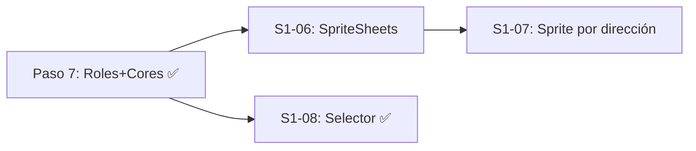

# Pasos 7-8 — Estado actual

> [!success] Pasos 1-6 completados
> El refactor técnico de base (SharedTextures, PlayerStats, UpgradeManager, Constants, ColisionManager, aimAngle) está completo y compilando. Ver [[Sesion-2026-05-06-Refactor-Base]] para el resumen completo.

> [!success] Paso 7 completado — 2026-05-07
> Sistema de roles y cores 100% implementado. Ver [[Sesion-2026-05-07-Cores-Selector]] para el resumen completo.

---

## Paso 7 — Sistema de Roles y Cores ✅

### Implementado en [[Sesion-2026-05-07-Cores-Selector]]

#### CoreEffect concretos

- [x] **`CaballeroCore`** (Fortaleza Reactiva) — stacks de armadura, −8% daño por stack, decay 4 s
- [x] **`MagoCore`** (Resonancia Caótica) — balas rebotan al enemigo más cercano, radio 200u
- [x] **`ShooterCore`** (Momentum de Combate) — combo kills acumula hasta −30% cooldown
- [x] **`NullCoreEffect`** — no-op singleton para `Role.base()`
- [x] `CoreEffect` ampliado con `getCooldownMultiplier()`, `getDamageReduction()`, `getBounces()`

#### Integración en el juego

- [x] `Player(x, y, Role)` constructor — usa `role.stats` y `role.coreEffect`
- [x] `Player.recibirDanio()` consulta `coreEffect.getDamageReduction()` y llama `coreEffect.onDamageReceived()`
- [x] `Player.update()` llama `coreEffect.onUpdate(this, delta)` cada frame
- [x] `Player.disparar()` consulta `coreEffect.getBounces()` y `coreEffect.getCooldownMultiplier()`
- [x] `GameScreen` notifica kills al core vía `player.onKill()`
- [x] `CharacterSelectScreen` — selector de personaje con 3 cards (S1-08)
- [x] `GameScreen` recibe `Role` como parámetro; ESC en game over vuelve al selector

> [!bug] Bug corregido — NoSuchElementException en LibGDX Array
> `Array<Enemy>` de LibGDX usa un iterador compartido singleton. Bucles `for-each` anidados sobre el mismo array corrompían el iterador. Fix: `enemigoCercano()` en `ColisionManager` usa iteración por índice.

---

## Paso 8 — Pipeline de sprites reales

### Assets disponibles

Sprites generados por PixelLab en `PIXEL/characters/` (64×64 px, 4 direcciones cada uno):

| Personaje | Carpeta | Sprites |
|-----------|---------|---------|
| Caballero | `PIXEL/characters/caballero/` | `caballero-south.png`, `caballero-east.png`, `caballero-north.png`, `caballero-west.png` |
| Mago | `PIXEL/characters/mago/` | `mago-south.png`, etc. |
| Shooter | `PIXEL/characters/shooter/` | `shooter-south.png`, etc. |

### Pendiente — S1-06 y S1-07

- [ ] **`utils/SpriteSheets.java`** — cargar PNGs de cada personaje con `Gdx.files.internal`
- [ ] **`Player.render()`** — determinar dirección (N/S/E/O) desde `velocity` y dibujar sprite correspondiente
- [ ] **Assets en carpeta correcta** — copiar PNGs de `PIXEL/characters/` a `lwjgl3/src/main/resources/`

> [!warning] Verificar ruta de assets
> LibGDX carga `Gdx.files.internal` desde el directorio `assets/` del módulo `lwjgl3`. Confirmar ruta antes de implementar `SpriteSheets`.

### Mejoras visuales aplicadas (2026-05-07)

- [x] `SharedTextures` — círculos pixel-perfect con filtro Linear (sin pixelado)
- [x] `Player.render()` — tintado por rol (Caballero teal, Mago púrpura, Shooter ámbar)
- [x] Balas player — tamaño aumentado a 14f, textura con glow
- [x] Arena boundary — círculo visible en `GameScreen` con `ShapeRenderer`

---

## Dependencias entre pasos

